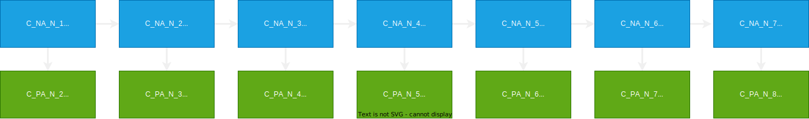

# Kombi Framework

A powerful MCO framework tailored for Skyrim combat enthusiasts. Leveraging OpenAnimationReplacer, Stances, Hkanno, and PayloadInterpreter, Kombi empowers you to craft personalized combo chains, infuse captivating visual enhancements, and refine pre-existing MCO animations. Unleash your creativity and forge an unparalleled moveset that reflects your distinct style within the Skyrim universe.

## Legend

1.1 Stances

- uses stances dynamic animatoin sets mod from https://www.nexusmods.com/skyrimspecialedition/mods/40484?tab=description

| Code |    Meaning     | Keybind |
| :--: | :------------: | :-----: |
|  LS  |   Low Stance   |    1    |
|  MS  |   Mid Stance   |    2    |
|  HS  |  High Stance   |    3    |
|  NS  | Neutral Stance |    4    |

1.2 Moveset Group
| Code | Meaning |
| :--: | :------: |
| C | Combo |
| S | Skill |
| A | Awakening |

1.3 Keytrace
| Code | Meaning |
| :--: | :------: |
| N | None |
| W | Up/Forward |
| S | Down/Backward |
| A | Left |
| D | Right |

1.3 Folder Naming Convention

    stanceCode_movesetGroup_attackType_keytrace_attackNumber

    ex. LS_C_W_1

## Moveset

### Combo Chaining

There are 3 available combo sets. Each NormalAttack of a combo set is connected to a NextAttack and NextPowerAttack.

### Combo Set 1: Neutral Combo

### Combo Set 2: Up/Forward Combo

### Combo Set 3: Down/Backward Combo

